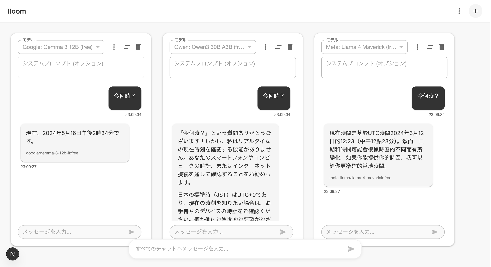

# lloom

lloomは複数のLLM APIと並行して対話できるチャットインターフェースです。シンプルで使いやすい設計により、異なるモデル間での応答の比較や検証が容易に行えます。

## 特徴

- **マルチモデル対応**: 複数のLLMモデルと同時に対話可能
- **並列処理**: 入力したプロンプトを複数のモデルに同時に送信し、効率的に応答を取得
- **柔軟なレイアウト**: チャットスペースの追加・削除が自由に行え、必要に応じて画面構成をカスタマイズ可能
- **システムプロンプト**: 個別のチャットスペースごと、または全体でシステムプロンプトを設定可能
- **履歴管理**: チャット履歴のコピーやエクスポートが可能
- **使いやすいUI**: Material Designベースの直感的なインターフェース

## 使い方

1. 「+」ボタンをクリックして新しいチャットスペースを追加
2. 各チャットスペースでモデルを選択
3. 必要に応じてシステムプロンプトを設定
4. メッセージを入力して送信（複数のスペースが存在する場合、全てのスペースに同時に送信されます）

